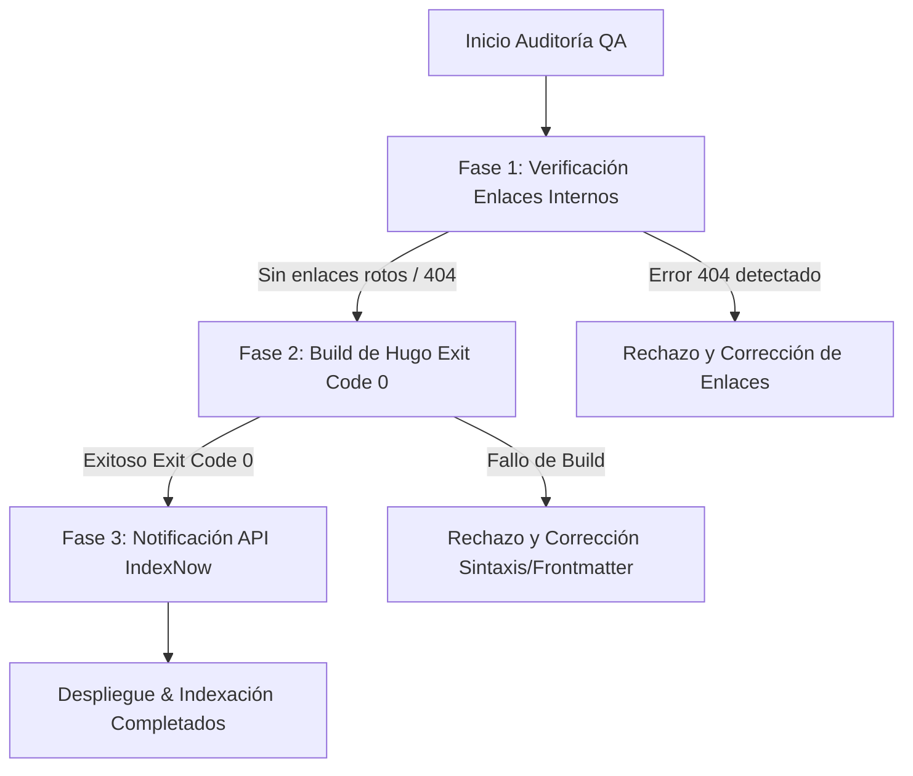

# SEO Auditor & Validator Skill

Esta habilidad define el protocolo de control de calidad final antes y después del despliegue en producción, verificando la integridad semántica de los enlaces internos, la validez del build estático en Hugo y la notificación automatizada a motores de búsqueda a través de IndexNow.

## 📋 Protocolo de Validación en 3 Fases



---

## 🔍 Fase 1: Validación de Enlaces Internos (Anti-404)

- **Auditoría de Enlaces**: Inspeccionar todos los enlaces Markdown de la forma `[Texto](/posts/categoria/slug/)` presentes en el artículo.
- **Verificación de Existencia**: Comprobar que el archivo `content/posts/categoria/slug/index.md` referenciado existe efectivamente en el repositorio.
- **E-E-A-T Spiderweb Rules**:
  - Garantizar que los enlaces apunten a contenidos de la misma categoría o categorías complementarias.
  - Rechazar enlaces con parámetros dinámicos no soportados o rutas locales absolutas fuera de la estructura de Hugo.

---

## 🏗️ Fase 2: Comprobación de Compilación en Hugo (Exit Code 0)

Antes de marcar cualquier contenido o cambio como listo para producción, se debe validar la generación del sitio mediante Hugo:

```bash
hugo --gc --minify
```

### Criterios de Aceptación:
- **Exit Code**: El comando debe devolver estrictamente el código de salida **`0`** (`$? == 0`).
- **Verificación de Warnings**: No deben registrarse advertencias críticas ni errores de parsing en Frontmatter YAML.
- **Rendimiento**: Confirmar que el renderizado de páginas no genera páginas en blanco o archivos `index.html` vacíos (0 bytes).

---

## 🚀 Fase 3: Notificación Instantánea con IndexNow API

Una vez publicado el nuevo Leaf Bundle y validado el build, se prepara la llamada de indexación instantánea enviando la lista de URLs a la API de IndexNow.

### Payload de Notificación (`IndexNow` JSON Payload):
```json
{
  "host": "novumworld.com",
  "key": "INDEXNOW_KEY_CONFIGURADA",
  "keyLocation": "https://novumworld.com/INDEXNOW_KEY_CONFIGURADA.txt",
  "urlList": [
    "https://novumworld.com/posts/tecnologia/arquitectura-rag-hugo/"
  ]
}
```

### Solicitud HTTP POST:
- **Endpoint**: `https://api.indexnow.org/indexnow` (o endpoints de Bing/Yandex/Seznam).
- **Headers**: `Content-Type: application/json; charset=utf-8`
- **Código Esperado**: `200 OK` o `202 Accepted`.

---

## 🚨 Acciones de Corrección Autónoma

1. Si la Fase 1 encuentra enlaces 404, reemplazarlos dinámicamente por enlaces válidos del índice de contenidos.
2. Si la Fase 2 falla (Exit Code != 0), inspeccionar los logs de Hugo, aislar el error en el Frontmatter o sintaxis Markdown y corregirlo antes de reintentar.
3. Si la Fase 3 falla con error de autenticación HTTP, verificar que `INDEXNOW_KEY` esté configurada en las variables de entorno o archivo de configuración.
